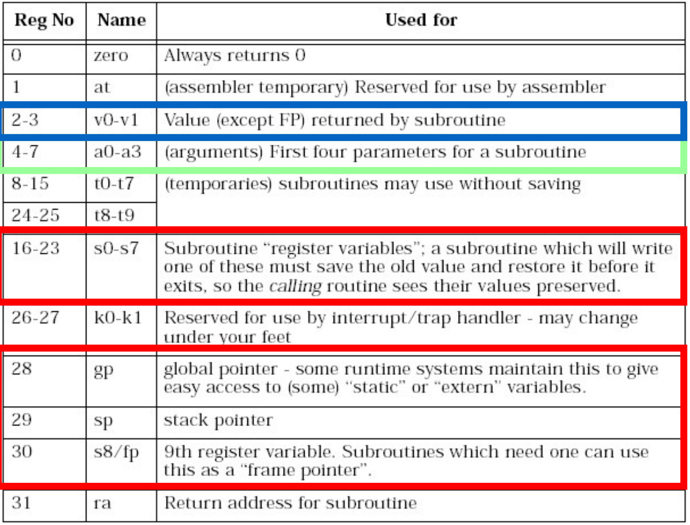

<h1>MIPS R300</h1>

---

- [Compiler Register Conventions](#compiler-register-conventions)
- [Simple Factorial](#simple-factorial)
- [Multiple Arguments](#multiple-arguments)

---

## Compiler Register Conventions


---

## Simple Factorial
```c++
int fact(int n)
{
    int r = 1;
    int i;
    for (i = 1; i < n+1; i++) {
        r = r * i;
    }
    return r;
}
```

```assembly
0: 1880000b blez a0,30 <fact+0x30>
4: 24840001 addiu a0,a0,1 # Branch if less than or equal to zero
8: 24030001 li v1,1
c: 24020001 li v0,1
10: 00430018 mult v0,v1
14: 24630001 addiu v1,v1,1
18: 00001012 mflo v0 # Move result of multiplication into v0 from LO
1c: 00000000 nop
20: 1464fffc bne v1,a0,14 <fact+0x14>
24: 00430018 mult v0,v1 # Branch if not equal to (if v1 != a0/ i != n + 1)
28: 03e00008 jr ra
2c: 00000000 nop
30: 03e00008 jr ra # If argument a0 less than or equal to 0, return 1
34: 24020001 li v0,1
```

## Multiple Arguments
```c++
main ()
{
    int i;
    i = sixargs(1,2,3,4,5,6);
}

int sixargs(int a, int b, int c, int d, int e, int f)
{
    return a + b + c + d+ e + f;
}
```

```assembly
0040011c <main>:
    40011c: 27bdffd8 addiu sp,sp,-40
    400120: afbf0024 sw ra,36(sp)
    400124: afbe0020 sw s8,32(sp)
    400128: 03a0f021 move s8,sp
    40012c: 24020005 li v0,5
    400130: afa20010 sw v0,16(sp)
    400134: 24020006 li v0,6
    400138: afa20014 sw v0,20(sp)
    40013c: 24040001 li a0,1
    400140: 24050002 li a1,2
    400144: 24060003 li a2,3
    400148: 0c10002c jal 4000b0 <sixargs>
    40014c: 24070004 li a3,4 # Branch delay, will execute
    400150: afc20018 sw v0,24(s8) # v0 is where the return value of sixargs is stored
    400154: 03c0e821 move sp,s8
    400158: 8fbf0024 lw ra,36(sp)
    40015c: 8fbe0020 lw s8,32(sp)
    400160: 03e00008 jr ra
    400164: 27bd0028 addiu sp,sp,40

004000b0 <sixargs>:
    4000b0: 27bdfff8 addiu sp,sp,-8
    4000b4: afbe0000 sw s8,0(sp)
    4000b8: 03a0f021 move s8,sp
    4000bc: afc40008 sw a0,8(s8)
    4000c0: afc5000c sw a1,12(s8)
    4000c4: afc60010 sw a2,16(s8)
    4000c8: afc70014 sw a3,20(s8)
    4000cc: 8fc30008 lw v1,8(s8)
    4000d0: 8fc2000c lw v0,12(s8)
    4000d4: 00000000 nop
    4000d8: 00621021 addu v0,v1,v0
    4000dc: 8fc30010 lw v1,16(s8)
    4000e0: 00000000 nop
    4000e4: 00431021 addu v0,v0,v1
    4000e8: 8fc30014 lw v1,20(s8)
    4000ec: 00000000 nop
    4000f0: 00431021 addu v0,v0,v1
    4000f4: 8fc30018 lw v1,24(s8)
    4000f8: 00000000 nop
    20
    4000fc: 00431021 addu v0,v0,v1
    400100: 8fc3001c lw v1,28(s8)
    400104: 00000000 nop
    400108: 00431021 addu v0,v0,v1
    40010c: 03c0e821 move sp,s8
    400110: 8fbe0000 lw s8,0(sp)
    400114: 03e00008 jr ra
    400118: 27bd0008 addiusp,sp,8
```