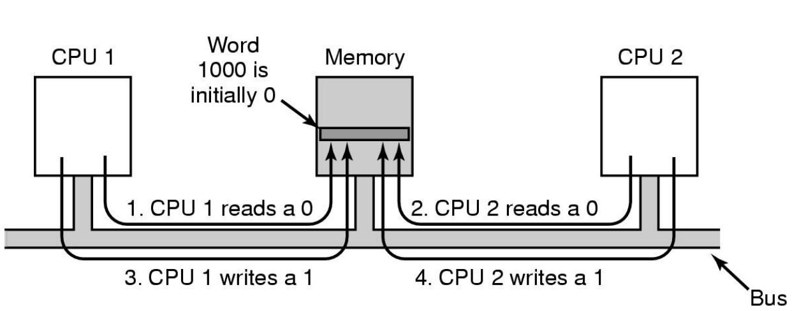
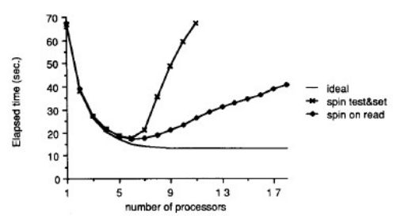

<h1>Multiprocessor Systems</h1>

---

- [Mutual Exclusion with Test-and-set](#mutual-exclusion-with-test-and-set)
- [Reducing Bus Contention](#reducing-bus-contention)
- [Compare Simple Spinlocks](#compare-simple-spinlocks)
  - [Test and set](#test-and-set)
  - [Read before Test and set](#read-before-test-and-set)
  - [Benchmark](#benchmark)

---

We need synchronisation across the multiple processors
# Mutual Exclusion with Test-and-set
```asm
enter_region:
    TSL REGISTER, LOCK  # Copy lock to register and set lock to 1: indivisible instruction
    CMP REGISTER, #0    # Was lock 0?
    JNE enter_region    # If it was non-zero, lock was set, so loop
    RET                 # Return to caller, critical region entered

leave_region:
    MOVE, LOCK, #0      # Store 0 in the lock
    RET
```

Works on a uniprocessor, doesn't work on an SMP


A **solution**:
- Hardware blocks all other CPUs from accessing the bus
during the TSL instruction to prevent memory accesses by
any other CPU.
  - TSL has mutually exclusive access to memory for duration of instruction.


# Reducing Bus Contention
- Read before TSL
  - Spin reading the lock variable waiting
for it to change
  - When it does, use TSL to acquire the
lock
- Allows lock to be shared read-only in
all caches until its released
  - no bus traffic until actual release
- No race conditions, as acquisition is
still with TSL.
```
start:
    while (lock == 1);
    r = TSL(lock);
    if (r == 1)
        goto start;
```

# Compare Simple Spinlocks

## Test and set
```c
void lock (volatile lock_t *l) {
    while (test_and_set(l)) ;
}
```

## Read before Test and set
```c
void lock (volatile lock_t *l) {
    while (*l == BUSY || test_and_set(l)) ;
}
```

## Benchmark
Measuring and comparing times for the following code to execute with 
1. Test and set
2. Read before test and set
```
for i = 1 .. 1,000,000 {
    lock(l)
    crit_section()
    unlock()
    compute()
}
```

**Results:**
